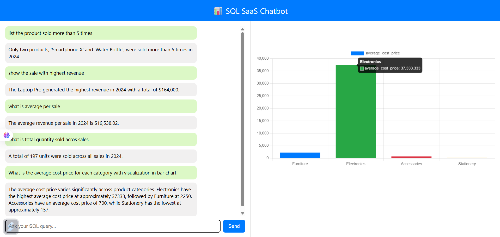

# 🧠 SQL Chatbot — Natural Language to SQL Querying Agent

A smart, production-ready chatbot that translates natural language into SQL queries and retrieves accurate results from structured tables. Designed for integration into dashboards or analytics platforms, it supports fast and reliable single-table queries — perfect for business users and data analysts.

---

## 📺 Demo



> 🔗 [Click here to view full demo](https://drive.google.com/file/d/1G003fx2-PGA3cuRXB29g53uj5AeAOHjp/view?usp=sharing)

---

## 📊 Database Tables

The agent currently supports the following **three structured tables**:

### `prods` — Product Information
| Column       | Description               |
|--------------|---------------------------|
| `pid`        | Product ID (Primary Key)  |
| `name`       | Product name              |
| `categ`      | Product category          |
| `cost_price` | Cost price of the product |

### `customer` — Customer Data
| Column     | Description                   |
|------------|-------------------------------|
| `cid`      | Customer ID (Primary Key)     |
| `name`     | Customer name                 |
| `joint_dt` | Date the customer joined      |
| `typ`      | Customer type (e.g., Premium) |

### `sales` — Sales Records
| Column         | Description                          |
|----------------|--------------------------------------|
| `id`           | Sales record ID (Primary Key)        |
| `product_name` | Name of the product sold             |
| `revenue`      | Revenue generated from the sale      |
| `region`       | Region where the sale occurred       |
| `customer`     | Name or ID of the customer           |
| `quantity`     | Quantity of product sold             |

---

## 💡 Features

- 🗣️ **Natural Language Interface**  
   Ask questions like “What is the total revenue by region?” or “Top 5 most expensive products”.

- ⚙️ **SQL Query Engine**  
   Converts plain English to fully functional SQL statements.

- 📈 **Data Visualization Ready**  
   Responses can be passed directly into Chart.js, D3.js, or Tableau.

- ⚡ **Fast Single-Table Queries**  
   Focuses on single-table queries for simplicity and performance.

---

## 🧪 Example Queries

### `prods`
- "List all products with a cost price above 1000"
- "Show number of products in each category"
- "What is the average cost price for each category?"

### `customer`
- "How many customers joined in 2023?"
- "List customers whose names start with 'S'"
- "Show customer count grouped by type"

### `sales`
- "Show total revenue by region"
- "Which products were sold more than 50 times?"
- "What are the top 5 products by total revenue?"

---

## 🛠️ Tech Stack

- **Backend:** Node.js + Express  
- **Database:** SQLite / MySQL / PostgreSQL (SQL-compliant)  
- **Natural Language Engine:** Custom logic or NLU APIs  
- **Visualization (Optional):** Chart.js / D3.js  
- **Environment:** Cross-platform, lightweight, REST-ready

---

## 🚀 Getting Started

```bash
# 1. Clone the repository
git clone https://github.com/yourusername/sql-chatbot.git
cd sql-chatbot

# 2. Install dependencies
npm install

# 3. Start the server
node server.js
